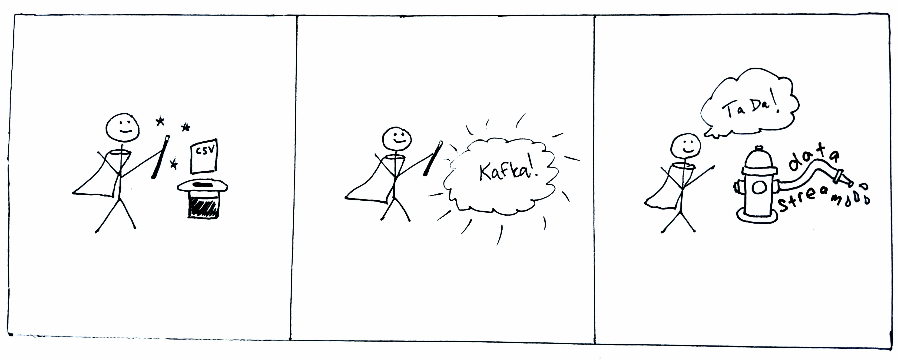

time-series-kafka-demo
============



Mock stream producer for time series data using Kafka.

I walk through this tutorial and others here on GitHub and on my [Medium blog](https://maria-patterson.medium.com/).  Here is a friend link for open access to the article on Towards Data Science: [*Make a mock “real-time” data stream with Python and Kafka*](https://towardsdatascience.com/make-a-mock-real-time-stream-of-data-with-python-and-kafka-7e5e23123582?sk=7ccd7b3383969c2b52c6606c12054c32).  I'll always add friend links on my GitHub tutorials for free Medium access if you don't have a paid Medium membership [(referral link)](https://maria-patterson.medium.com/membership).  

If you find any of this useful, I always appreciate contributions to my Saturday morning [fancy coffee fund](https://github.com/sponsors/mtpatter)!

This repo demos how to convert a csv file of timestamped data into a real-time stream useful for testing streaming analytics.
An example input file with random time series data and a script for generating the file are included in the data directory.

The producer and consumer Python scripts use [Confluent's Kafka client for Python](https://github.com/confluentinc/confluent-kafka-python), which is installed in the Docker image built with the accompanying Dockerfile, if you choose to use it.

Requires Docker and Docker Compose.

Usage
-------------------

Clone repo and cd into directory.

```
git clone https://github.com/mtpatter/time-series-kafka-demo.git
cd time-series-kafka-demo
```

**Start the Kafka broker**

```
docker compose up --build
```

**Build a Docker image (optionally, for the producer and consumer)**

From the main root directory:

```
docker build -t "kafkacsv" .
```

If you want to use Docker for the python scripts, this should now work:

```
docker run -it --rm kafkacsv python bin/sendStream.py -h
```

**Start a consumer**

To start a consumer for printing all messages in real-time from the stream "my-stream":

```
python bin/processStream.py my-stream
```

or with Docker:

```
docker run -it --rm \
      -v $PWD:/home \
      --network=host \
      kafkacsv python bin/processStream.py my-stream
```

**Produce a time series stream**

Send time series from data/data.csv to topic “my-stream”, and speed it up by a factor of 10.

```
python bin/sendStream.py data/data.csv my-stream --speed 10
```

or with Docker:

```
docker run -it --rm \
      -v $PWD:/home \
      --network=host \
      kafkacsv python bin/sendStream.py data/data.csv my-stream --speed 10
```

**Shut down and clean up**

Stop the consumer with Return and Ctrl+C.

Shutdown Kafka broker system:

```
docker compose down
```
